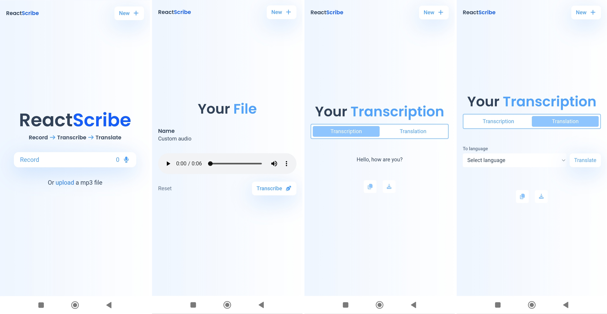

# 🎙️ React Transcribe

## 📝 Descripción

React Transcribe es una aplicación web moderna desarrollada con React que permite transcribir audio y realizar traducciones de manera eficiente. La aplicación procesa archivos de audio y genera transcripciones precisas, con la capacidad adicional de traducir el contenido a diferentes idiomas.

## ✨ Características Principales

- 🎯 Transcripción de audio a texto
- 🌍 Traducción de transcripciones
- 📁 Soporte para múltiples formatos de audio
- 💻 Procesamiento local (sin necesidad de servidores externos)
- 🚀 Interfaz de usuario intuitiva y moderna

## 👉🏽 Preview 



## 🛠️ Tecnologías Utilizadas

- **React** - Framework principal de desarrollo
- **Vite** - Herramienta de construcción y desarrollo
- **Tailwind CSS** - Framework de estilos
- **@xenova/transformers** - Biblioteca para procesamiento de audio y traducción
- **Web Workers** - Para procesamiento en segundo plano

## 🗂️ Estructura del Proyecto

```
src/
├── components/         # Componentes de React
│   ├── FileDisplay     # Visualización de archivos
│   ├── Header         # Encabezado de la aplicación
│   ├── HomePage       # Página principal
│   ├── Information    # Información y ayuda
│   ├── Transcribing   # Componente de transcripción
│   ├── Transcription  # Visualización de transcripciones
│   └── Translation    # Componente de traducción
├── utils/             # Utilidades
│   ├── presets.js     # Configuraciones predefinidas
│   ├── translate.worker.js    # Worker para traducciones
│   └── whisper.worker.js      # Worker para transcripciones
└── assets/           # Recursos estáticos
```

## 🚀 Instalación y Uso

1. **Clonar el repositorio:**

```bash
git clone https://github.com/DulcePy/react-transcribe.git
cd react-transcribe
```

2. **Instalar dependencias:**

```bash
npm install
```

3. **Iniciar el servidor de desarrollo:**

```bash
npm run dev
```

4. **Construir para producción:**

```bash
npm run build
```

## 💡 Cómo Usar

1. Abre la aplicación en tu navegador
2. Sube un archivo de audio
3. Selecciona las opciones de transcripción
4. Espera a que se complete el proceso
5. ¡Listo! Podrás ver la transcripción y traducirla si lo deseas
